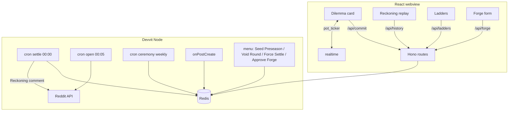

# ARCHITECTURE — The Commons

## Stack

| Layer | Choice | Why |
|---|---|---|
| Client | React + CSS choreography (no Phaser — stated honestly) | The game is UI craft: envelopes, needles, reveal bursts |
| Server | Devvit serverless Node + Hono | `/api/*` + `/internal/*` |
| State | Devvit Redis (server-held secrets + zsets + tx) | Sealed commits require server-only state |
| Jobs | Scheduler cron ×3 (settle, open, weekly ceremony) | The midnight settle IS the game clock |
| Live | Realtime `pot_ticker` | participation + pot only; secrecy preserved |
| Boilerplate | `devvit-template-react` (official) | No boilerplates.json match for Devvit |

No ML anywhere (anti-AI-slop stance); dilemma content is parameterized game theory, not generated prose.

## System diagram

## Redis schema

| Key | Type | Content |
|---|---|---|
| `round:{day}` | hash | archetype, params, state (open/settled), pot, participants |
| `commit:{day}` | hash | userId → {choice, stake} — **server-only, never serialized pre-settle** |
| `outcome:{day}` | hash | split, result, perUser payouts (post-settle) |
| `streak:{id}` | hash | current, best, insuranceHeld |
| `rep:saint` / `rep:serpent` / `season:points` | zset | consequence ladders (weekly decay) |
| `forge:queue` | zset | pending dilemma templates (ts-scored) |
| `forge:approved` | set | forge templates cleared for rotation |
| `round:current` | string | day number the game clock currently points at |
| `round:index` | zset | day → day, so history can enumerate rounds (no key-scan on platform) |
| `pot:{day}` | string | display-only pot counter (authoritative pot recomputed at settle) |
| `settled:last` | string | day of the most recently settled round |
| `post:{postId}` | string | postId → day, so triggers recognize the app's own day posts |
| `flair:templates` | string | cached flair template ids (JSON) |
| `ceremony:last` | string | last weekly ceremony result (JSON), for in-app crown chips |

## API endpoints

| Route | Method | Purpose |
|---|---|---|
| `/api/round` | GET | tonight's card + participation count + pot (never the split) |
| `/api/commit` | POST | sealed commit + stake (tx: one per account; races settle safely) |
| `/api/history` | GET | my results + last N Reckonings (post-settle data only) |
| `/api/forge` | POST | dilemma template submission (filtered → queue) |
| `/api/ladders` | GET | Saint / Serpent / season-points standings |
| `/internal/cron/settle` | POST | idempotent resolve + payouts + Reckoning comment |
| `/internal/cron/open` | POST | create day post + open round |
| `/internal/cron/ceremony` | POST | weekly crown Saint/Serpent/Wildcard + decay ladders ×0.8 |
| `/internal/triggers/post-create` | POST | bind day-state to the scheduler-created post |
| `/internal/menu/*` | POST | Seed Preseason · Void Round · Force Settle · Approve Forge |

## Invariants & residual risk

I1–I3 in COMPLEXITY.md (no pre-settle leak; one commit/account; idempotent settle). **Residual:** alt-account sybil pressure (mod void tooling + per-sub economy blast radius; stated honestly); a missed cron delays but never corrupts (settle re-runnable, Force Settle menu drill rehearsed). **Flair verification CLOSED 2026-07-04:** `setUserFlair`/`createUserFlairTemplate` confirmed in `@devvit/reddit@0.13.6` .d.ts (docs-cache/VERIFIED.md) — flair-as-consequence is a firm design commitment.
