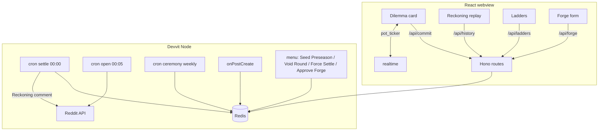

<div align="center">
  
  <h1>The Commons 🕯️</h1>
  <p><em>One secret choice a night. The whole subreddit lives with it.</em></p>
  

  <br/><br/>

  [](https://www.reddit.com/r/the_commons_game_dev/)
  [](https://www.youtube.com/watch?v=mgUb0PFsIW0)
  [](https://devpost.com/software/the-commons)
  [](https://edycutjong.github.io/the-commons/)
  [](https://edycutjong.github.io/the-commons/pitch/)
  [](https://redditgameswithahook.devpost.com)

  <br/>

  
  
  
  
  
  
  [](https://github.com/edycutjong/the-commons/actions/workflows/ci.yml)
</div>

---

**The problem.** Most "daily" Reddit games close the loop the instant you play — there's nothing to come back for — and most "community" games are a thousand people playing alone in the same post.
**The solution.** The Commons runs **one sealed social dilemma per night**; nobody — not even the UI — sees the crowd's split until a single midnight transaction settles it, and the morning **Reckoning** reveals what the community did to itself.
**What's built (green).** A Devvit Web app: a pure percent-threshold **payoff engine** (5 archetypes), a **structurally-sealed** commit protocol, one **idempotent `watch/multi/exec` settle**, a deterministic six-round **preseason seed**, and a playable webview that **fires the reveal on cold open** (no waiting for real midnight). **222 passing tests, 100% coverage** on the shared/core/routes gate, settle **10k-commit p95 ~50ms** (measured; < 2s budget).

---

Every night the app posts one dilemma — _"THE BLACKOUT POT: if 70%+ **FEED**, every stake multiplies; **HOARDERS** take 3× — but if the hoarding tips the line, the pot burns."_ Players commit **one sealed choice**. Nobody — not other players, not the leaderboard, **not even the UI** — can see the split until the midnight settle. At 00:00 UTC a single idempotent transaction resolves everyone's fate; **The Reckoning** posts the outcome, streaks pay out, and the week's most saintly and most treacherous players wear **Saint / Serpent flair** in the subreddit. You cannot learn what happened to you without coming back tomorrow. Retention is the skeleton, not a bolt-on.

A Reddit Devvit Web game (Hono server + framework-free webview). **Zero runtime AI. Verified Devvit APIs only.**

---

## 📜 Rules

1. **READ** tonight's dilemma: the payoff structure is public (plain sentences), and a live `souls · pot` ticker climbs as players seal — the server broadcasts those two integers on the realtime `pot_ticker` channel and the webview reflects the count (polled) — **but never the split.**
2. **COMMIT** one sealed choice + a stake of season points (optionally buy **streak insurance**). One commit per account, ever — no take-backs. The envelope seals; a countdown to the reveal begins.
3. **RETURN** after midnight: the Reckoning replays — split bars, the verdict line (_"58% hoarded. The pot burned."_), your personal result, and the night's new Saints & Serpents. Tonight's dilemma is already open.

- **Season economy:** everyone starts at 100 points; each settled night pays your dilemma delta + a flat participation reward (floored at 0). Max stake 50.
- **Streaks & insurance:** consecutive settled nights build a streak; **insurance** (40 pts) forgives one losing night so your streak survives.
- **Reputation ladders:** **Saint** score rewards the cooperative choice (conviction, not luck — a burned feeder still earns it); **Serpent** score rewards _profitable_ betrayal. Weekly ceremony crowns #1 Saint, #1 Serpent, and a seeded Wildcard with flair, then decays both ladders ×0.8 so titles circulate.
- **Dilemma Forge (UGC):** players submit a parameterized dilemma (payoff sliders + ≤140-char flavor through a wordlist filter) → moderator approval queue → rotation, author credited on the post.

---

## 🌅 The cold open (what a lone judge sees first)

A judge often arrives mid-cycle, alone, on a phone — they can't wait for a real midnight. So the webview **leads with the reveal, not a form**: on load it animates the seeded catastrophe — the biggest self-inflicted collapse in the feed, **"58.0% hoarded. The pot burned."** (bars sweep in, the verdict punches, a red flash) — then a **TONIGHT** divider and the same mechanic *open right now*, then the rest of the seeded feed. The "oh" lands in the first few seconds from the seeded state; the judge's own sealed commit then teaches the retention hook (_"I can't learn my fate without coming back"_). The featured round is chosen deterministically (`ruin` whose plurality choice was non-cooperative, ranked by crowd size) and clearly badged **PRESEASON**. See `DEMO.md`.

---

## 🎲 Payoff archetypes (all 5)

All thresholds are **percent-based**, so the drama is identical at 8 players or 8,000. All deltas are integers. Every resolver is a pure function of `(params, commits)` — no randomness, no clocks.

| Archetype | Choices | Cooperative | Group wins when… | Winners get | Losers get |
|---|---|---|---|---|---|
| **Public Pot** | FEED / HOARD | FEED | `feed% ≥ threshold` (def **0.70**) | feeders ×`feedMult` (2), hoarders ×`hoardMult` (3) | otherwise the **pot burns** — every stake lost |
| **Stag Hunt** | STAG / HARE | STAG | `stag% ≥ threshold` (def **0.80**) | stags ×`stagMult` (3); hares **always** bank ×`hareMult` (1.5) | if the hunt fails, stags lose their whole stake |
| **Chicken** | SWERVE / DARE | SWERVE | `dare% ≤ crashFrac` (def **0.50**) | darers ×`dareMult` (3), swervers ×`swerveMult` (1.25) | on a crash, darers lose all; swervers merely keep theirs (push) |
| **Lowest Unique Bid** | BID_1…BID_5 | _(none)_ | mixed by design | the **rarest** bid (ties → lower) wins ×`winMult` (4) | everyone else burns `loseFrac` (0.5) of stake |
| **Exact-N Heist** | GUARD / HEIST | GUARD | alarm holds (no valid crew) | heist inside `targetFrac ± band` (0.125 ± 0.05) → heisters ×`heistMult` (5) | wrong-size crew → heisters lose all, guards collect ×`guardMult` (1.5); a cracked vault costs guards 25% |

Forge submissions clamp every param onto its slider grid (`min/max/step`), so no player-authored dilemma can escape the tested envelope.

---

## 🏗️ Architecture

A Devvit Web app: a **Hono server** over a pure, platform-free payoff engine, with a
**React webview** client. Full Redis schema + endpoint tables in
[`ARCHITECTURE.md`](ARCHITECTURE.md).



---

## 🔒 Sealed-secrecy architecture (invariant I1)

The secret split is the whole game. Secrecy is **structural**, not a filter you can forget to apply:

- **Commits live only in `commit:{day}` (a Redis hash), server-side.** They are read for the first time inside the settle transaction. No endpoint returns them pre-settle.
- **The pre-settle projections cannot carry a split.** `RoundView` (`/api/round`) exposes only `participants` and `pot` — no per-choice counts, no per-user data. `/api/history` returns open rounds **not at all**. `tests/endpoints.test.ts` asserts these shapes key-by-key and sweeps the raw JSON for split-shaped leakage for both logged-in and logged-out viewers.
- **Realtime broadcasts exactly two integers** (`{ participants, pot }`) on `pot_ticker`. Broadcasting the split would kill the game, so the type literally cannot express it.
- **Settle is one idempotent `watch/multi/exec` pass** (invariant I3). A commit racing the settle either lands before the flip or is cleanly told _"the envelope is sealed"_ — nothing partial ever lands (invariant I2: one commit per account via `HSETNX`). Re-running settle (scheduler retry or **Force Settle** menu) is byte-identical: the engine is a pure function of `(commits, params)` and `settledAt` is pinned for seeded rounds.

**Redis uses sorted-sets + hashes + strings only** — no plain lists/sets (Devvit Redis has no key-scan; `round:index` is a zset so history can enumerate). Schema: `round:{day}`, `commit:{day}`, `outcome:{day}`, `streak:{userId}`, `rep:saint`, `rep:serpent`, `season:points`, `forge:queue`, `forge:approved`, `round:current`, `round:index`, `pot:{day}`, `settled:last`, `post:{postId}`, `flair:templates`, `ceremony:last`.

---

## ✅ Compliance notes

- **In-app ballots only.** Every choice is a sealed in-app commit through `POST /api/commit`. The game **never** uses Reddit up/down-votes as ballots or game input — Reddit voting is not a mechanic here. (Enforced by `scripts/check_submission_readiness.mjs`, which greps for any vote calls.)
- **Verified Devvit APIs only.** Reddit surface used: `getCurrentUsername`, `submitCustomPost`, `submitComment` + `Comment.distinguish(makeSticky)`, `setUserFlair`, `createUserFlairTemplate` — all verified in `@devvit/reddit@0.13.6` `.d.ts` (see `docs-cache/VERIFIED.md`). Redis: `zAdd/zRange/zScore/zRem/zCard`, `hSet/hGet/hGetAll/hSetNX/hDel/hLen/hKeys`, `get/set/incrBy/del/exists`, `watch/multi/exec`. Realtime: `realtime.send`.
- **Empty fetch allowlist.** `devvit.json` declares no external `http` domains; the client only calls same-origin `/api/*`.
- **Zero runtime AI.** No LLM SDK is imported anywhere in `src/`. The payoff engine _is_ the content generator.

### Honest limitation — sybil / alt-accounts

One commit per Reddit account is enforced transactionally (`HSETNX` keyed by `userId`), and the economy is **siloed per subreddit** with seasonal resets. But a determined player can still run alt-accounts; there is **no** device/IP fingerprinting (Devvit doesn't expose it, and we won't fake it). Mitigations are social and operational: per-sub economy, seasons, moderator **Void Round** / **Force Settle** tools, and constrained UGC (sliders + filtered flavor, mod-approved). We call this out rather than pretend it's solved.

---

## 🧪 Test & build

```bash
npm install
npm run lint          # eslint (flat config, typescript-eslint) — clean
npm run type-check    # tsc --noEmit — clean
npm run test          # vitest — 222 tests across 21 files, all passing
npm run test:coverage # vitest --coverage — 100% statements/branches/functions/lines
                      # on src/shared/** + src/server/core/** + src/server/routes/**
npm run build         # vite build → dist/client/{splash,game}.html + dist/server/index.cjs
npm run bench         # settle-latency table (100/1k/10k, p50/p95); PRD budget: 10k < 2s
npm run check         # submission-readiness gate (files + config + compliance + tsc/test/build)
npm run seed:local    # dry-run the deterministic seed and print the six Reckonings
```

**Exact test count: 222 tests, 21 files.** Coverage: the pure payoff engine (per-archetype + property tests), reputation/streak/economy updaters, the settle transaction (idempotency, the commit-vs-settle race, void, insurance, malformed-data resilience), the sealed-shape endpoint protocol, the deterministic Seed Preseason, the weekly flair ceremony, and a settle-latency smoke test. `npm run test:coverage` holds **100% statements/branches/functions/lines** on the pure/mockable business logic (`src/shared/**`, `src/server/core/**`, `src/server/routes/**`) — `src/client/**` (React webview) and `src/server/index.ts` (process bootstrap) are excluded, same rationale as the Honest Limitations below. 15 `/* v8 ignore */` comments mark genuinely-unreachable-by-construction defensive branches (unique-key sort tie-breaks, shipped-fixture data-integrity guards, always-populated map lookups) — never a shortcut for an untested real path.

---

## ⚙️ Engineering harness

Every push and PR runs the real gates on Node 20 via GitHub Actions (`.github/workflows/ci.yml`): `npm ci` → `eslint .` → `tsc --noEmit` → `vitest run --coverage` (100% gate) → `vite build` → `node scripts/bench.mjs` (the settle-latency budget gate). CodeQL (`javascript-typescript`) and Dependabot (npm + github-actions) run on their own schedules.

| Layer | Tool | Status |
|---|---|---|
| Lint | `eslint .` (flat config, typescript-eslint) | ✅ clean |
| Type safety | `tsc --noEmit` (strict, `noUncheckedIndexedAccess`) | ✅ clean |
| Unit / integration | Vitest — **222 tests, 21 files** | ✅ passing |
| Coverage | Vitest `--coverage` (v8) — **100%** statements/branches/functions/lines on shared/core/routes | ✅ gate enforced |
| Build | Vite → `dist/client/{splash,game}.html` + `game.js` + `dist/server/index.cjs` | ✅ |
| Performance gate | `scripts/bench.mjs` — settle **10k p95 ~50ms** (budget 2s) | ✅ PASS |
| Submission compliance | `scripts/check_submission_readiness.mjs` — no lists/sets, zero AI, no Reddit votes, empty fetch allowlist, verified-Reddit-surface-only | ✅ |
| SAST | CodeQL (`javascript-typescript`) | ✅ |
| Supply chain | Dependabot (npm + github-actions) | ✅ |

**N/A for this project (Devvit Web, no served localhost):** Lighthouse CI and Playwright-against-`localhost` are intentionally omitted — the client is a Devvit webview rendered inside the Reddit post sandbox, not a Next.js app served on a port, so there is no local URL to point a headless browser at. The equivalent quality gates here are the sealed-shape endpoint tests and the settle bench. The one step no CI can do is `devvit playtest` (see below).

---

## 🚀 First playtest checklist

You cannot `devvit playtest` from CI — this is the human step. In order:

1. **Front-load the subreddit ban round-trip (do this DAY ONE).** New hackathon subreddits are being **auto-banned** by Reddit safety automation ("Rule #2"), **including re-bans immediately after you install a Devvit app** (see `docs-cache/VERIFIED.md`). From your aged main account: create **r/the_commons_game_dev** (and any spare test subs), add a **normal pinned post before installing anything**, and keep the unban forum thread handy — `redditgameswithahook.devpost.com/forum_topics/44175-…`. Expect a re-ban at first app install and request the manual unban there. Install `dr-admin-approve` per the rules.
2. **Green locally first:** `npm run check` should print `READY.` (runs type-check + 222 tests + build).
3. **`npm run login`** (`devvit login`) with the account that owns the app.
4. **`npm run dev`** (`devvit playtest r/the_commons_game_dev`) and open the installed post.
5. In the subreddit, run the mod menu **"The Commons: Seed Preseason"** — six labeled Reckonings + tonight's live round appear (deterministic; re-runnable).
6. Walk the judge path in **[DEMO.md](./DEMO.md)**.

Moderator menu actions: **Seed Preseason · Void Round · Force Settle · Approve Forge Dilemma**. Cron: settle `0 0 * * *`, open `5 0 * * *`, weekly ceremony `0 1 * * 1`.

---

## 🚧 What this is not (yet)

The webview client (`src/client/`) is the honest, playable **core loop** — dilemma → sealed commit → Reckoning — in the midnight-violet design language. It **now includes** the Reckoning reveal choreography (bars sweep in, verdict punches, `ruin` flash), the reveal-first cold open, the live-ticker poll, and the in-app feed of past Reckonings. It is still **not** the full `UI.md` choreography: the commit-side **envelope/wax-seal animation** is unbuilt, and the **Forge** and **Ladders** screens have complete, tested servers (`/api/forge`, `/api/ladders`) but no dedicated screen yet — post-hackathon polish. See `docs/friction-log.md`.

---

## 🔖 Versioning

Automatic semantic versioning via [semantic-release](https://semantic-release.gitbook.io/):
every push to `main` parses [Conventional Commits](https://www.conventionalcommits.org/)
(`fix:` → patch, `feat:` → minor, `BREAKING CHANGE:` → major) and, when warranted,
bumps `package.json`, updates `CHANGELOG.md`, tags the commit, and publishes a
GitHub Release with generated notes (`.github/workflows/release.yml`). No manual
version bumps, no npm registry publish (private app).

## 📄 License

[MIT](LICENSE) © 2026 Edy Cu. Built for Reddit's *Games with a Hook* hackathon.
